# Sports Scheduler

## Introduction

**Sports Scheduler** is a web application that helps people organize, create, discover, and join sports sessions.

The application supports two types of users:

* **Administrator** – manages the sports available in the application, creates and manages sessions, and views reports.
* **Player** – signs up, creates sport sessions, browses available sessions, joins sessions, and manages their own sessions.

The project was developed as part of the **WD501 Advanced Backend Capstone Project**.

---

## User Stories

### Administrator

As an administrator, I can:

* Sign in using my email and password.
* Create and manage sports available for players.
* Create sport sessions.
* View and manage scheduled sessions.
* Mark completed sessions.
* View reports for sessions played.
* Filter reports using a configurable date range.
* View the relative popularity of different sports.

### Player

As a player, I can:

* Sign up using my name, email, and password.
* Sign in and sign out.
* Browse upcoming sport sessions.
* View details of existing sessions.
* Create my own sport sessions.
* Join available sessions.
* See participants who have joined a session.
* View sessions I have created separately.
* View sessions I have joined separately.
* Cancel a session that I created and provide a cancellation reason.
* See cancellation information for sessions I previously joined.
* Receive notifications about relevant session activity.
* Change my own password.
* Be prevented from joining multiple scheduled sessions at the same date and time.

---

## Key Features

### Authentication and Authorization

* Player registration and login.
* Secure password hashing using bcrypt.
* Session-based authentication using Passport.js.
* Role-based access for Administrators and Players.
* Logout functionality.
* Change password functionality.

### Sports Management

Administrators can:

* Create sports.
* Edit sports.
* Activate or deactivate sports.
* View available sports.

### Sport Sessions

Administrators and players can:

* Create sport sessions.
* Select an available sport.
* Specify date and time.
* Specify the venue.
* Specify the number of additional players required.
* View session details.
* Track participants.
* View created sessions.

### Joining Sessions

Players can:

* Browse upcoming sessions.
* Join available sessions.
* See joined participants.
* View their joined sessions separately.
* Cannot join past sessions.
* Cannot join cancelled or completed sessions.
* Cannot join the same session more than once.
* Cannot join two scheduled sessions occurring at the same date and time.

### Session Cancellation

Players can cancel sessions that they created.

* A cancellation reason can be provided.
* The session is not deleted.
* The cancelled status is clearly displayed.
* Previous participants are preserved.
* Participants are notified about the cancellation.

### Session Completion

Administrators can mark scheduled sessions as completed.

Completed sessions remain available for historical reporting.

### Notifications

Users receive notifications for relevant session activity, including:

* A player joining a created session.
* A session being cancelled.
* A session being completed.

Users can mark individual notifications or all notifications as read.

### Reports

Administrators can view reports for a configurable date range, including:

* Total sessions.
* Completed sessions.
* Cancelled sessions.
* Scheduled sessions.
* Total participants.
* Sport popularity.
* Completed sessions by sport.

---

## Application Workflow

The main workflow of the application is:

1. An administrator signs in.
2. The administrator creates the sports available for scheduling.
3. An administrator or player creates a sport session.
4. Players browse upcoming sessions.
5. Players view session details and join available sessions.
6. Joined participants are displayed in the session.
7. A session creator can cancel their session and provide a reason.
8. Administrators can mark scheduled sessions as completed.
9. Administrators can view reports and sport popularity.
10. Users receive notifications about relevant session activities.

---

## Screenshots

### Home and Authentication

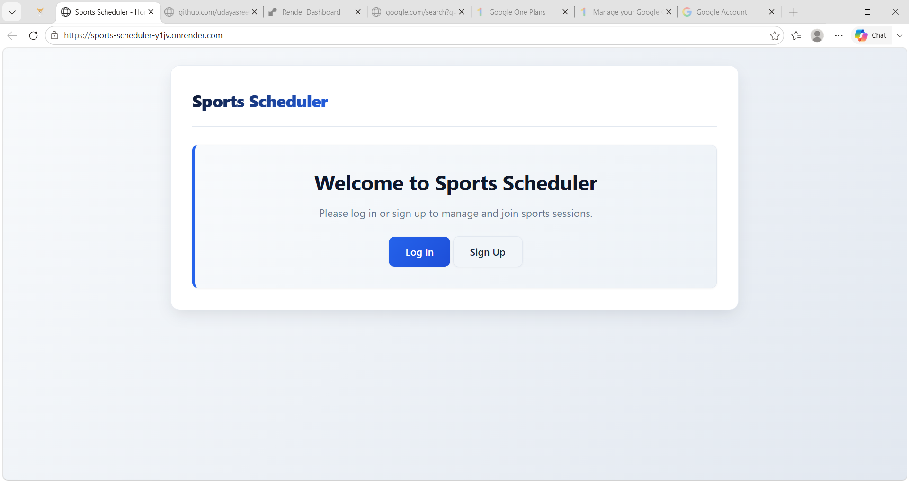

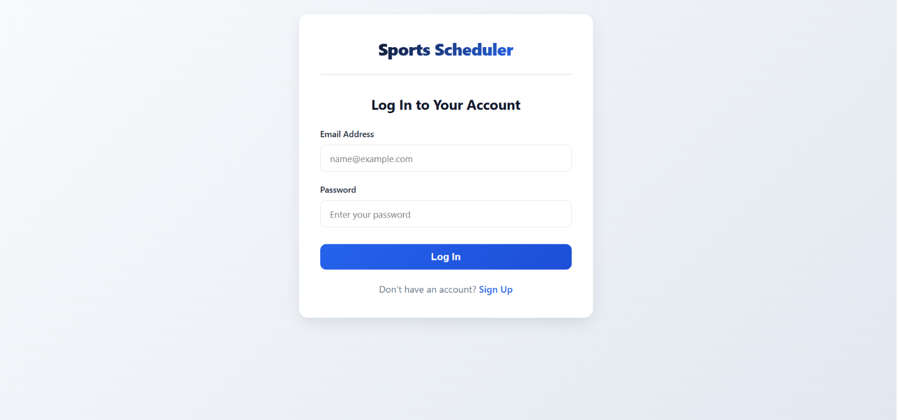

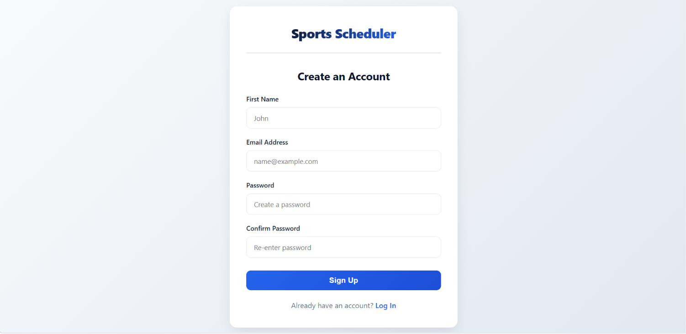

### Administrator

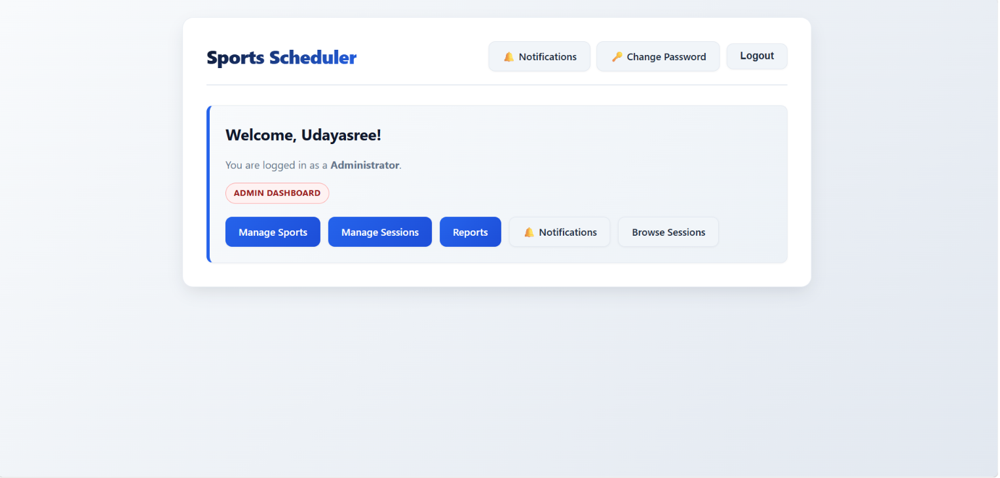

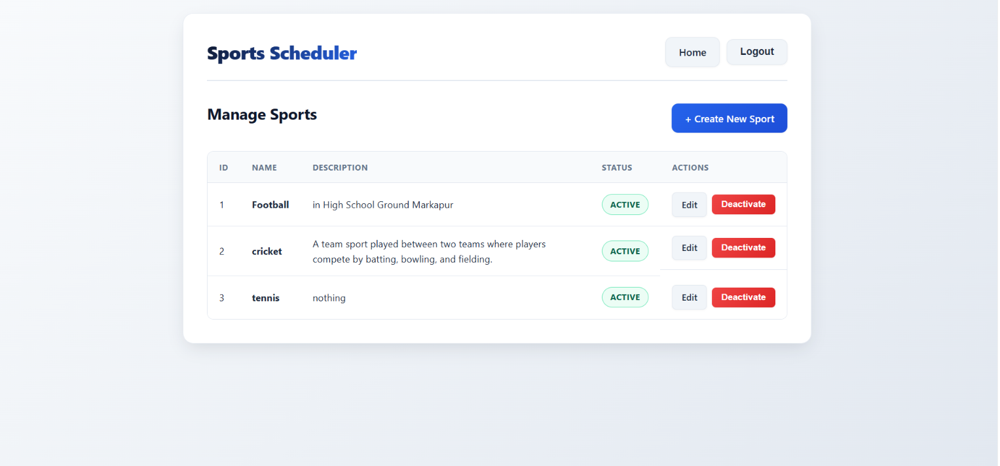

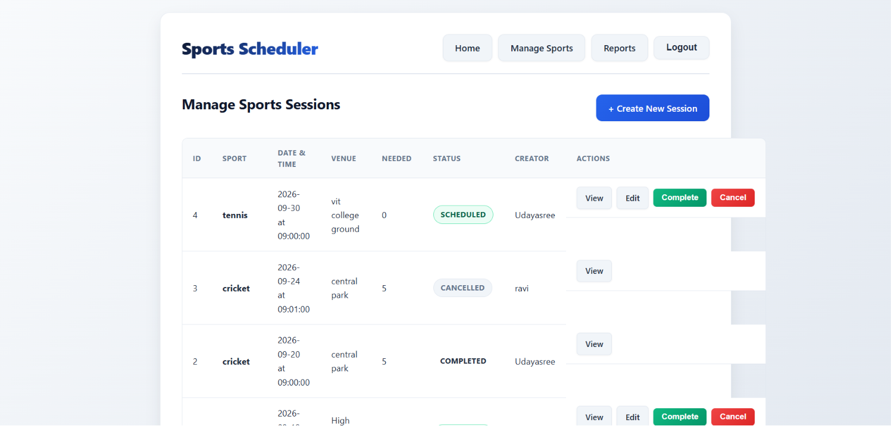

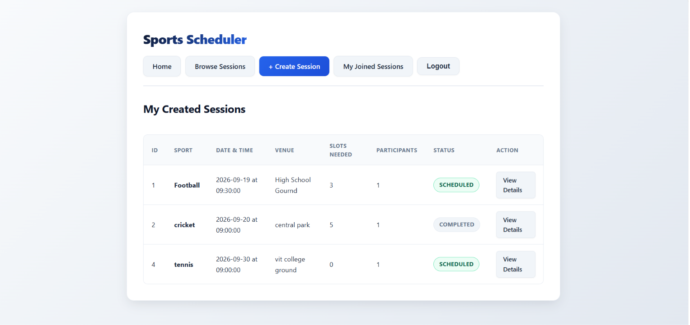

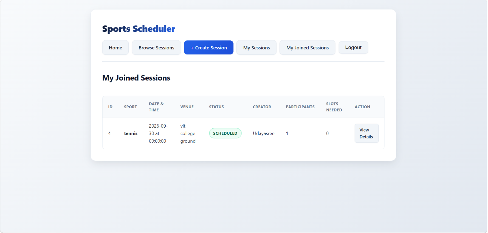

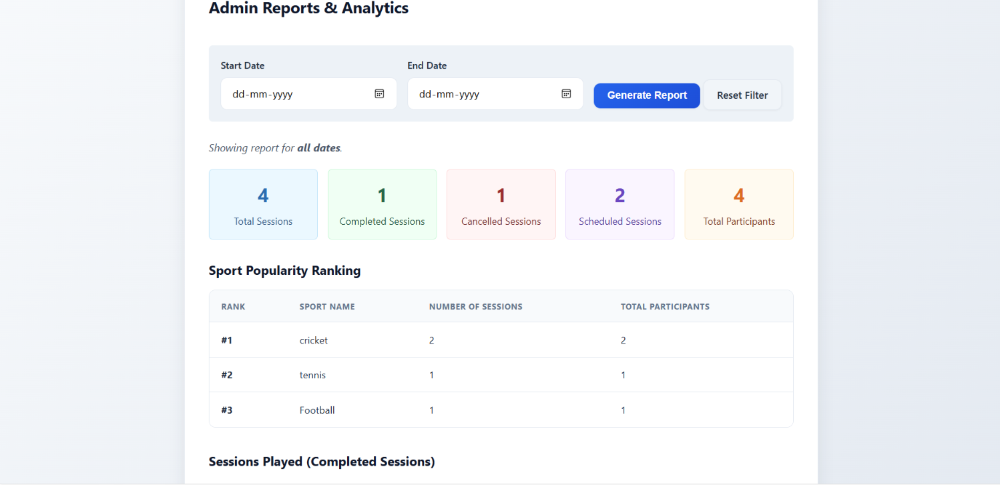

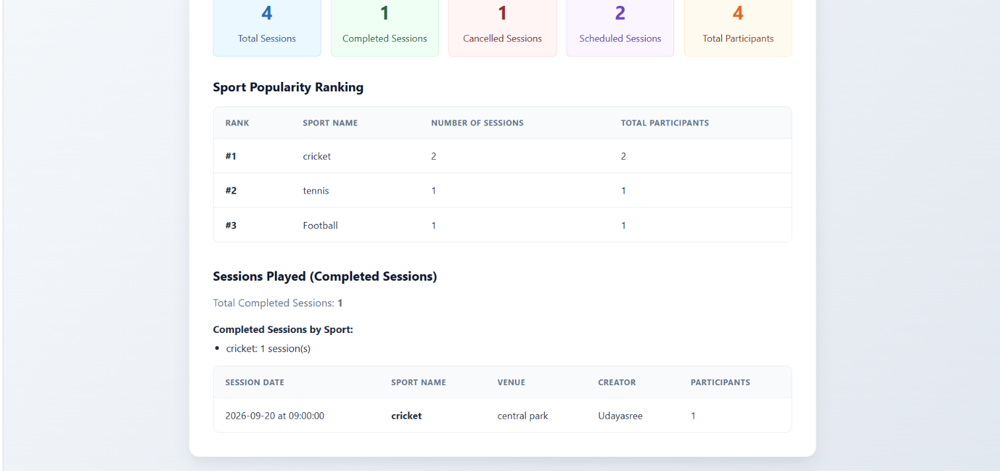

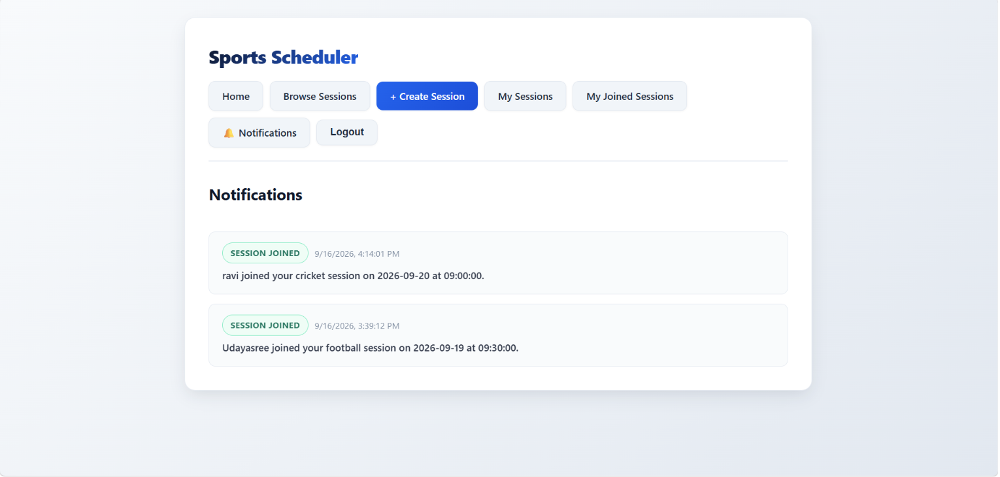

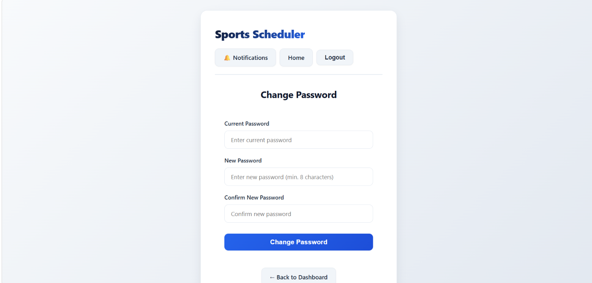

### Player

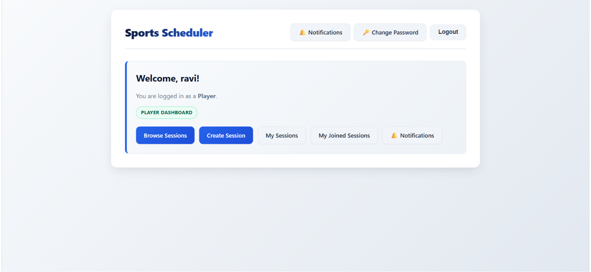

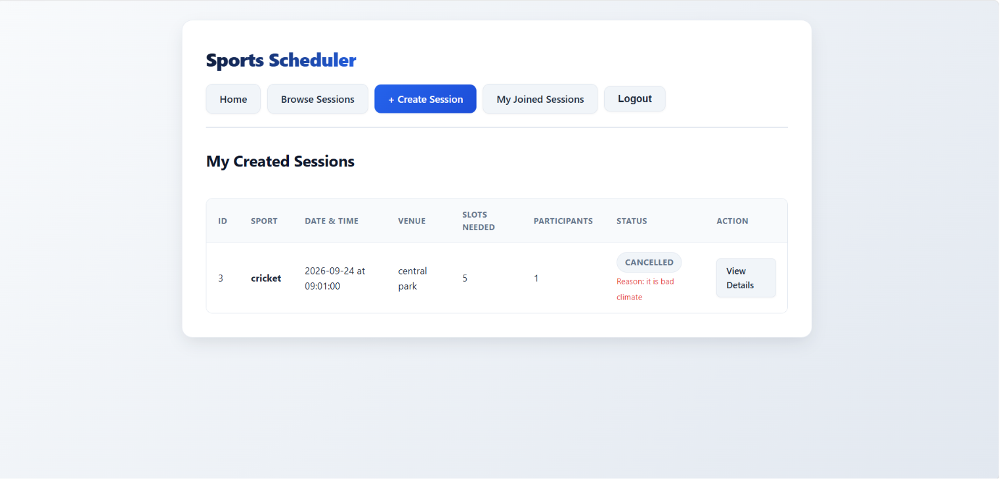

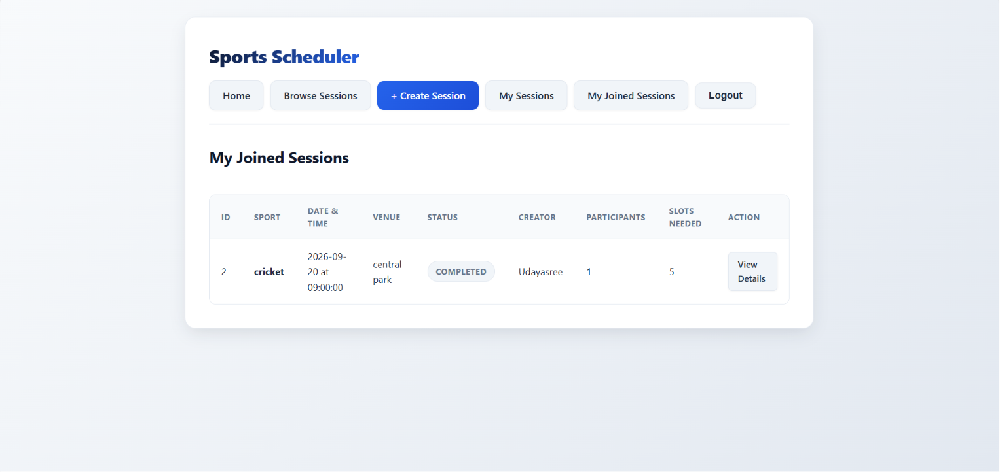

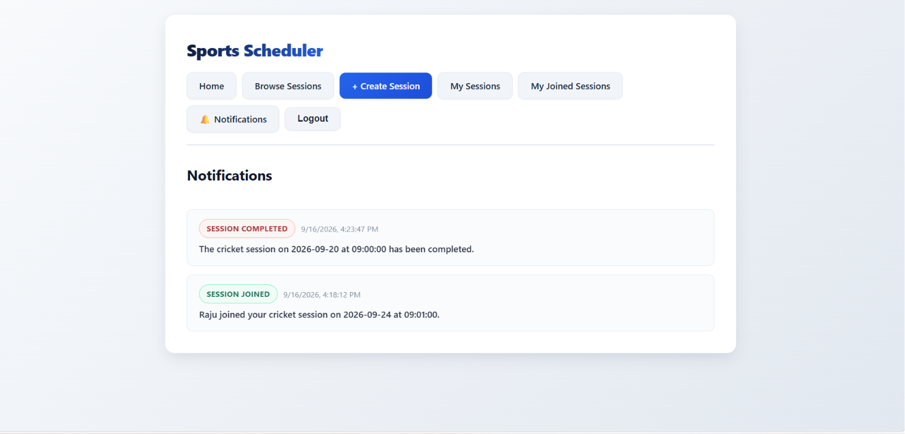


## Live Application

The deployed application is available here:

**[Sports Scheduler – Live Application](https://sports-scheduler-y1jv.onrender.com)**

---

## Video Demonstration

A video demonstration will be added here before final submission.

**Video Link:**
`[Add video link here]`

The demonstration will cover:

1. Homepage
2. Administrator login
3. Creating a sport
4. Player login
5. Creating a sport session
6. Joining an existing session
7. Viewing reports
8. An interesting or challenging implementation
9. Additional optional features

---

## Optional Features Implemented

The project also includes the optional features suggested in the WD501 guidelines:

### Change Password

All authenticated users can change their own password after verifying their current password.

### Same Date and Time Conflict Prevention

Players are prevented from joining another scheduled session when they already have a session at the same date and time.

---

## Tech Stack

* **Backend:** Node.js, Express.js
* **Templating:** EJS
* **Frontend:** HTML5, CSS3
* **Database:** PostgreSQL
* **ORM:** Sequelize
* **Authentication:** Passport.js, Passport Local Strategy
* **Password Security:** bcrypt
* **Sessions:** express-session
* **Security:** CSRF protection
* **Utilities:** connect-flash, dotenv
* **Testing:** Jest, Supertest
* **Deployment:** Render

---

## Database

The application uses PostgreSQL with Sequelize ORM.

Main database entities include:

* Users
* Sports
* Sessions
* Participants
* Notifications

Database schema changes are managed using Sequelize migrations.

---

## Testing

The application includes automated tests using **Jest** and **Supertest**.

Current verified test status:

* **Test suites:** 13 passed
* **Tests:** 154 passed
* **Failures:** 0

Run the test suite using:

```bash
npm test
```

---

## Local Setup

### 1. Clone the repository

```bash
git clone https://github.com/udayasree006/sports-scheduler.git
cd sports-scheduler
```

### 2. Install dependencies

```bash
npm install
```

### 3. Configure environment variables

Create a `.env` file using `.env.example` as a reference.

Configure the required PostgreSQL database and session environment variables.

**Never commit `.env` or any passwords, credentials, or secrets to GitHub.**

### 4. Run database migrations

```bash
npm run db:migrate
```

### 5. Start the development server

```bash
npm run dev
```

The application will be available at:

```text
http://localhost:3000
```

### 6. Run tests

```bash
npm test
```

---

## Project Structure

```text
sports-scheduler/
│
├── config/          # Database and Passport configuration
├── middleware/      # Authentication and authorization middleware
├── migrations/      # Sequelize database migrations
├── models/          # Sequelize database models
├── routes/          # Application routes
├── views/           # EJS templates
├── public/          # CSS and static assets
├── tests/           # Automated tests
│
├── app.js           # Express application configuration
├── server.js        # Application entry point
├── package.json     # Project dependencies and scripts
├── .env.example     # Environment variable template
└── README.md        # Project documentation
```

---

## Project Status

The Sports Scheduler implements the required features described in the **WD501 Advanced Backend Capstone** project guidelines.

The application is deployed on Render and includes additional optional features such as password changing, notifications, session completion, and same-date/time session conflict prevention.
